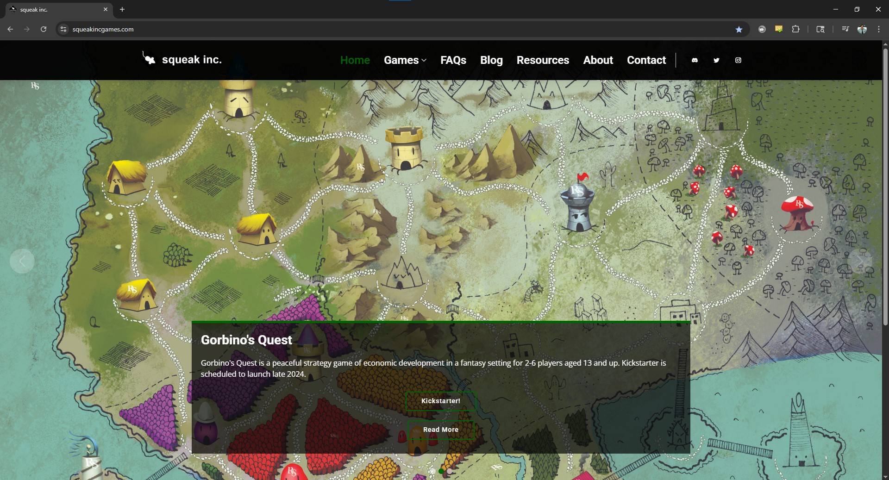
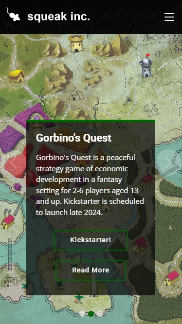

# squeak inc. Games

**Tiny Pieces, Huge Fun**

Welcome to squeak inc. Games - a board game company dedicated to creating memorable tabletop experiences that bring people together. We are curators of imagination, architects of connection, and champions of playfulness.

## About the Website

This website serves as the digital home for squeak inc. Games, showcasing our collection of board games, company philosophy, and community engagement. Whether you're a casual player seeking laughter or a strategist hungry for challenges, you'll find your place in our ever-expanding world of games and camaraderie.

## Featured Games

- **Gorbino's Quest** - Our flagship game: a peaceful strategy game of economic development in a fantasy setting for 2-6 players aged 13 and up. Build cities, trade resources, and compete to become the worthiest citizen of Eldoria. [Kickstarter campaign now live!](https://www.kickstarter.com/projects/joeyvigil/gorbinos-quest-0)
- **Spirit Bathhouse** - A mystical board game experience
- **Hand and Foot in Mouth: Deluxe** - An entertaining card game
- **Thirty One** - A classic game reimagined

## Website Features

- **Games Portfolio**: Detailed information about each of our board games, including rules and gameplay mechanics
- **Blog**: Behind-the-scenes insights into our creative process, game design philosophy, and industry updates
- **Resources**: Helpful links and tools for board game enthusiasts and creators
- **FAQs**: Answers to common questions about our games and company
- **Community Links**: Connect with us on Discord, Twitter, and Instagram

## Our Mission

At squeak inc. Games, we create experiences that transcend mere gameplay. We believe in the magic of bringing people together around a table, fostering laughter, camaraderie, and memorable moments that last a lifetime. Our games balance strategy, unpredictability, and a sprinkle of squeaky fun, designed to be accessible to newcomers while deeply satisfying for seasoned players.

## Links

**Live Website**: <https://squeakincgames.com/>

**GitHub Pages**: <https://joeyvigil.github.io/squeakincgames/>

**Social Media**:
- Discord: <https://discord.gg/Z5r9G2tFHF>
- Twitter: <https://twitter.com/SettlersotCosmo>
- Instagram: <https://www.instagram.com/squeakinc.games/>

## Technology

This website is built with:
- HTML5
- Bootstrap 5
- CSS3 with custom styling
- JavaScript for interactive elements
- Various vendor libraries (AOS, Glightbox, Swiper, etc.)

## Screenshots

### Desktop Display

### Mobile Display

---

© Copyright squeak inc. Games. All Rights Reserved.
